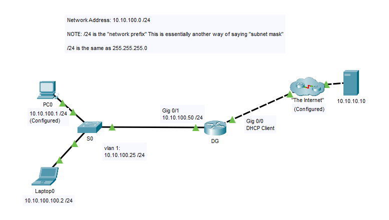

# Routing & Switching Configurations (Practice SBA)

This project contains a simulated configuration task for a small routed network using **Cisco Packet Tracer**. It serves as a practice Skills-Based Assessment (SBA) for networking students and helps reinforce essential configuration tasks on routers, switches, and end devices.

## 🧠 What You Will Learn
- Router interface configuration (physical)
- Switch virtual interface (SVI) setup
- IP addressing and DHCP
- TFTP configuration and file transfer
- Console/VTY security
- Telnet configuration
- Connectivity verification via ping and traceroute
- Saving configurations and reading running-config

---

## 🗺️ Topology

Network: `10.10.100.0/24` (Same as 255.255.255.0)

---

## 💻 Devices Involved
- Router (Hostname: `DG`)
- Switch (Hostname: `S0`)
- End devices: Laptop0 and PC0

---

## ✅ Configurations Performed

### 🔹 Router (DG)
- Set hostname and disable DNS lookup
- Configure MOTD banner
- Set console and VTY passwords: `cisco`
- Enable Telnet: `transport input telnet`
- Encrypt all passwords
- Set `enable secret` password: `class`
- Configure interface `Gig0/0/1`:
  - IP: `10.10.100.50 255.255.255.0`
  - Description: LAN Default Gateway
- Configure interface `Gig0/0/0`:
  - IP from DHCP
  - Description: Uplink to Internet
- Save running config
- Verify connectivity and upload config to TFTP server

### 🔹 Switch (S0)
- Hostname, MOTD banner, console and VTY passwords: `cisco`
- Enable password: `class`
- Encrypt passwords
- Assign IP address (shown in topology)
- Set default gateway: `ip default-gateway 172.16.100.50`
- Save config and verify connectivity
- Upload config to TFTP

### 🔹 Laptop0
- Manual IP configuration, subnet mask, default gateway
- Test pings and traceroutes to:
  - PC0
  - Switch S0
  - Default Gateway
  - Internet server (`10.10.10.10`)
  - Perform `tracert` for local and remote IPs

---

## 📂 Files Included
- `Routing & Switching Configurations.pka` – Cisco Packet Tracer file
- `Topology.png` – Visual diagram of the configured network

---

## 📤 How to Use
1. Open the `.pka` file in Cisco Packet Tracer
2. Follow the instructions in the README to repeat and practice
3. Save your progress and try doing it within 10 minutes for mastery

---

## 📬 Contact
Created by [Mustafa Jawish](https://github.com/Mustafa22J)

📫 Email: ender201619@gmail.com  
🌐 Portfolio: [mustafa22j.github.io](https://mustafa22j.github.io)  
💼 LinkedIn: [mustafa-jawish-959b45225](https://linkedin.com/in/mustafa-jawish-959b45225)

---

> "Don't memorize commands. Master the tasks."

---

## 📌 Note
Practice regularly until you can complete all configurations confidently and efficiently. This exercise mimics real-world troubleshooting and configuration challenges.
